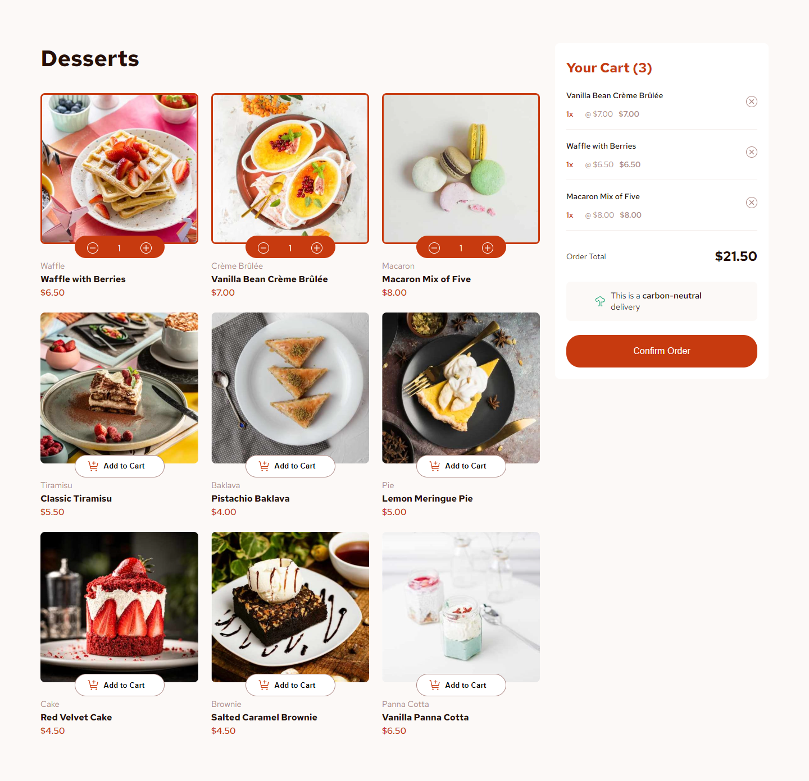

# Frontend Mentor - Product list with cart

## Description

Thanks for checking out this front-end coding challenge. This challenge comes from [Frontend Mentor](https://www.frontendmentor.io). The project provides a list of products with a cart. In addition, the order confirmation appears in a order dialog.

### Features

Users can:

- Add items to the cart and remove them
- Increase/decrease the number of items in the cart
- See an order confirmation modal when they click "Confirm Order"
- Reset their selections when they click "Start New Order"
- View the optimal layout for the interface depending on their device's screen size
- See hover and focus states for all interactive elements on the page

### Technologies

I used:

- Angular 18.2.0
- Sass (scss)
- BEM methodology
